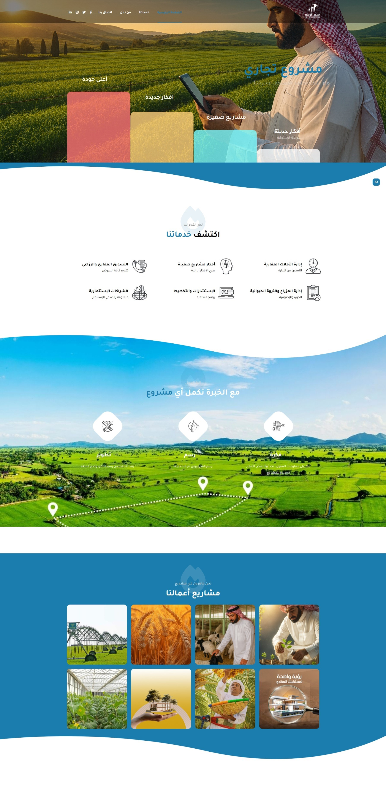

---

# Al-Sour Al-Awsat Company Website

Production Case Study

Professional corporate website developed for Al-Sour Al-Awsat Company to showcase real estate, agriculture, and livestock management services with a modern Arabic-first user experience.

---

## 📑 Table of Contents

- [🚀 Project Overview](#-project-overview)
- [✨ Key Features](#-key-features)
- [🧠 Website Structure](#-website-structure)
- [🎨 UI/UX Direction](#-uiux-direction)
- [📱 Responsive Experience](#-responsive-experience)
- [🧳 Technologies](#-technologies)
- [📸 Screenshots](#-screenshots)
- [🌍 Live Website](#-live-website)
- [📌 Project Information](#-project-information)
- [📈 Project Impact](#-project-impact)
- [🔒 Source Code](#-source-code)
- [📬 Contact Information](#-contact-information)

---

## 🚀 Project Overview

Al-Sour Al-Awsat Company Website is a fully customized corporate website developed to represent the company’s identity and services in the real estate, agriculture, and livestock sectors.

The project was designed to create a strong digital presence that improves brand credibility, presents company services professionally, and enables smooth communication with clients and partners.

The website focuses on clean Arabic UI/UX, responsive layouts, service presentation clarity, and a structured navigation experience optimized for all devices.

---

## ✨ Key Features

- Fully responsive Arabic-first website
- RTL-compatible interface
- Modern corporate UI design
- Dedicated service pages
- Company profile & About section
- Projects & portfolio showcase
- Contact forms and communication sections
- SEO-friendly website structure
- Mobile-first responsive layouts
- Fast-loading optimized pages
- WordPress content management system
- Clean navigation hierarchy
- Interactive service presentation

---

## 🧠 Website Structure

### 🏠 Main Pages

- Home
- About Us
- Services
- Projects
- Contact Us

### 🏢 Service Sections

- Real Estate Project Management
- Farm Management
- Livestock Management
- Property Management
- Electronic Contract Management

### 📞 Communication Features

- Contact forms
- Phone & email integration
- Direct communication sections
- Company information blocks

---

## 🎨 UI/UX Direction

The interface was designed with a professional and clean visual direction focused on corporate credibility and Arabic readability.

The UI strategy focused on:

- Clear visual hierarchy
- Modern RTL layouts
- Easy service discoverability
- Mobile usability
- Consistent spacing and typography
- Professional business-oriented branding

The design combines simplicity with modern corporate aesthetics to improve trust and user engagement.

---

## 📱 Responsive Experience

The website was fully optimized for:

- Mobile devices
- Tablets
- Desktop screens

Special attention was given to:

- Arabic RTL responsiveness
- Flexible content sections
- Readable typography
- Fast mobile navigation
- Optimized spacing across screen sizes

---

## 🧳 Technologies

- HTML5
- CSS3
- JavaScript
- WordPress
- Elementor

---

## 📸 Screenshots

### Homepage

---

## 🌍 Live Website

https://sorost.sa/

👉 View full case study on my website:  
https://mahmoudabuyoussef.com/projects/al-sour-al-awsat

---

## 📌 Project Information

| Field        | Details                   |
| ------------ | ------------------------- |
| Project Type | Corporate Website         |
| Industry     | Real Estate & Agriculture |
| Role         | WordPress Developer       |
| Platform     | WordPress                 |
| Duration     | 1 Week                    |
| Status       | Production                |
| Year         | 2025                      |

---

## 📈 Project Impact

- Improved company online presence
- Enhanced brand credibility and professionalism
- Simplified communication with clients and partners
- Presented company services in a structured way
- Delivered fully responsive Arabic experience
- Created scalable and manageable CMS structure

---

## 🔒 Source Code

This project was developed for a real production environment.

The source code is private and not publicly available due to client and production restrictions.

This repository is intended for project presentation and case study purposes only.

---

## 📬 Contact Information

If you'd like to collaborate, discuss a project, or hire me for development work:

- 📧 Email: contact@mahmoudabuyoussef.com
- 💼 LinkedIn: https://www.linkedin.com/in/mahmoudabuyoussef
- 🌐 website: https://mahmoudabuyoussef.com
- 🐙 GitHub: https://github.com/mahmoud-abuyoussef
